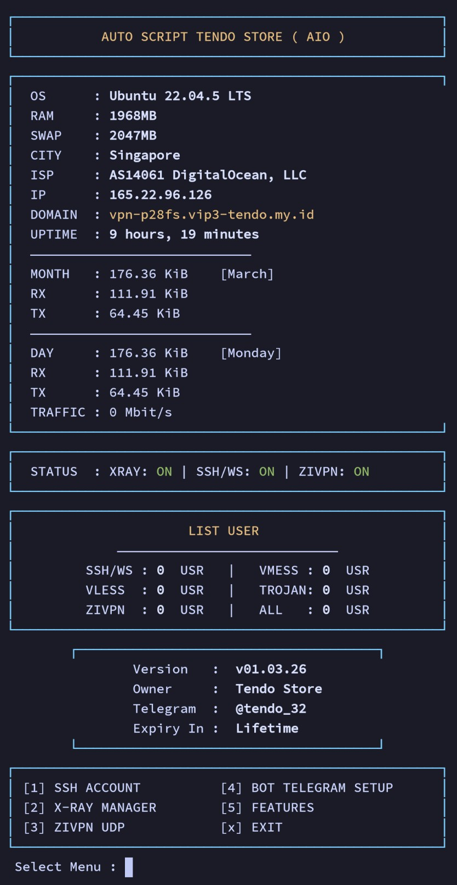

# 🚀 AUTO SCRIPT TENDO STORE (AIO)
### Free VPN Auto Installer Script | X-Ray, ZIVPN, SSH & WebSocket

<div align="center">


</div>

---

### 📥 Cara Instalasi (Quick Install)
Gunakan VPS dengan kondisi **Fresh Install**. Login ke terminal sebagai **root** dan jalankan perintah berikut:

```bash
apt update -y && apt upgrade -y
wget -qO setup [https://raw.githubusercontent.com/tendostore/AUTO-SCRIPT-TENDO-STORE-AIO/main/setup](https://raw.githubusercontent.com/tendostore/AUTO-SCRIPT-TENDO-STORE-AIO/main/setup)
chmod +x setup
./setup
```

> **Catatan Penting:** Pastikan VPS dalam keadaan bersih sebelum instalasi agar konfigurasi berjalan sempurna tanpa konflik.

---

### 📝 Deskripsi Proyek
**Tendo Store Auto Script (AIO)** adalah solusi instalasi otomatis VPN server versi Free yang dirancang untuk performa tinggi dan kemudahan pengelolaan bagi siapa saja. Script ini sangat ringan, minim bug, dan memiliki antarmuka UI Terminal yang rapi.
---

### 🖥️ Dashboard Preview
Tampilan antarmuka utama (Dashboard) yang didesain bersih, informatif, dan sangat mudah digunakan.

<div align="center">

<p><i>(Unggah file screenshot Anda dengan nama <b>dashboard.jpg</b> ke repositori GitHub agar gambar muncul di sini)</i></p>
</div>

---

### 💎 Fitur Unggulan (Free Features)

#### 🔐 Manajemen Protokol & Jaringan
* **Multi-Protocol X-Ray:** Instalasi otomatis untuk VMESS, VLESS, dan TROJAN.
* **Modern Network:** Mendukung WebSocket (WS), gRPC, dan HTTPUpgrade untuk bypass sensor ISP.
* **SSH & WebSocket (WS):** Integrasi OpenSSH dan Dropbear 2019 dengan Python WS Proxy untuk koneksi stabil.
* **ZIVPN UDP:** Jalur bypass super cepat melalui port khusus UDP 5667.
* **BadVPN UDPGW:** Mendukung port 7100, 7200, dan 7300 untuk stabilitas WhatsApp & Gaming.

#### 🛡️ Sistem Keamanan & Anti-Abuse
* **Limit Multi-Login:** Pengecekan jumlah login IP atau session secara real-time untuk mencegah penyalahgunaan.
* **Auto-Lock Hukuman:** Secara otomatis mengunci akun selama 10 menit jika pengguna melanggar batas login.
* **Quota Management:** Menghapus akun secara otomatis jika kuota bandwidth (GB) telah habis.
* **Anti-Duplicate:** Mencegah pembuatan akun dengan Username atau UUID yang sudah terpakai.

---

### 🤖 Integrasi Telegram Bot Cerdas
Skrip ini dilengkapi asisten bot Telegram untuk mempermudah pemantauan server Anda secara otomatis:

* **Real-Time Login Notif:** Laporan otomatis pengguna aktif dikirim setiap menit langsung ke chat Telegram Anda.
* **SSH PID Tracker:** Pelacakan user SSH 100% akurat menggunakan algoritma pgrep.
* **Laporan Detail:** Menyertakan info IP Client, Domain Server, ISP, hingga sisa Kuota Bandwidth.
* **Auto-Backup System:** Pencadangan data akun (.zip) dikirim otomatis ke Telegram sesuai jadwal.

#### 📖 Tutorial Penggunaan Bot Telegram
* **Buat Bot:** Chat @BotFather, buat bot baru, dan simpan API Token Anda.
* **Ambil Chat ID:** Chat @MissRose_bot dan ketik /id untuk mendapatkan Chat ID Anda.
* **Konfigurasi VPS:** Jalankan perintah menu, pilih **BOT TELEGRAM SETUP**, dan masukkan Token serta Chat ID Anda.

---

### 🖥️ Spesifikasi Minimal VPS

| Komponen | Spesifikasi Minimal | Rekomendasi |
|---|---|---|
| **Sistem Operasi** | Ubuntu 20.04 / Debian 11 | Ubuntu 22.04 / Debian 12 |
| **RAM** | 1 GB | 2 GB atau lebih |
| **CPU** | 1 Core | 2 Core atau lebih |
| **Virtualisasi** | KVM / VMWare | KVM (Kernel Based) |

---

### 🌐 Informasi Port Layanan

| Layanan / Protokol | Port yang Digunakan |
|---|---|
| **OpenSSH** | 22, 444 |
| **Dropbear** | 90 |
| **SSH WebSocket (WS)** | 80, 8080, 2082, 2083, 8880 |
| **SSH WS TLS / SSL** | 443, 8443 |
| **X-Ray (Vmess/Vless/Trojan)** | 443 (TLS), 80 (Non-TLS) |
| **ZIVPN (UDP)** | 5667 |
| **Badvpn UDPGW** | 7100, 7200, 7300 |

---

### 📞 Hubungi Kami (Contact & Support)

> 📢 **LAPOR BUG:** Jika Anda menemukan bug dalam penggunaan script ini, mohon segera lapor ke admin melalui kontak di bawah:

* **Telegram** : @tendo_32
* **WhatsApp** : +6282224460678
* **Owner** : Tendo Store

<div align="center">
<br>
<i>Strictly No Spam, DDOS, or Hacking. Use responsibly.</i>
<br><br>
<b>© 2026 Tendo Store. All Rights Reserved.</b>
</div>
